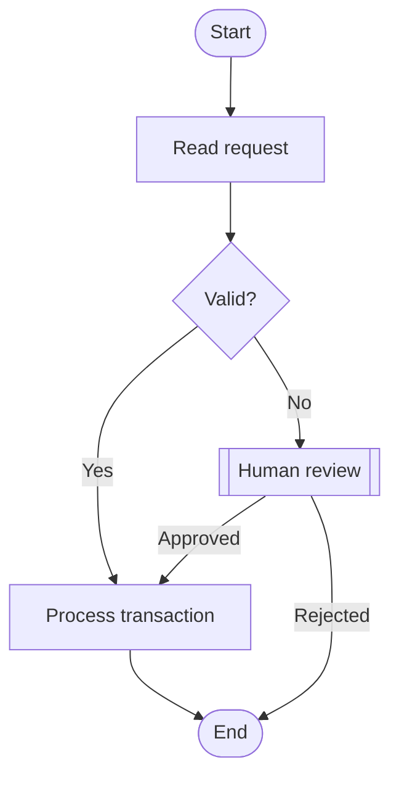
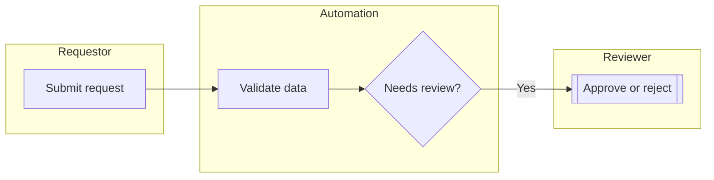
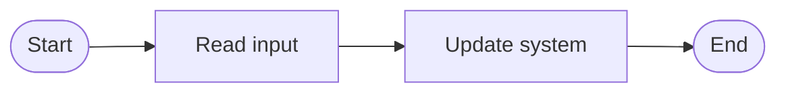
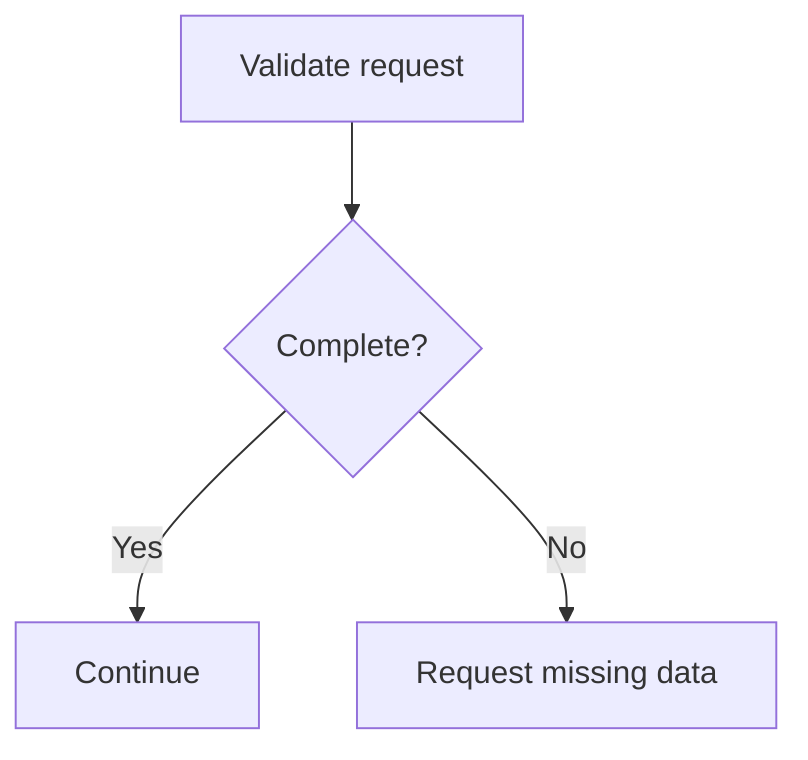
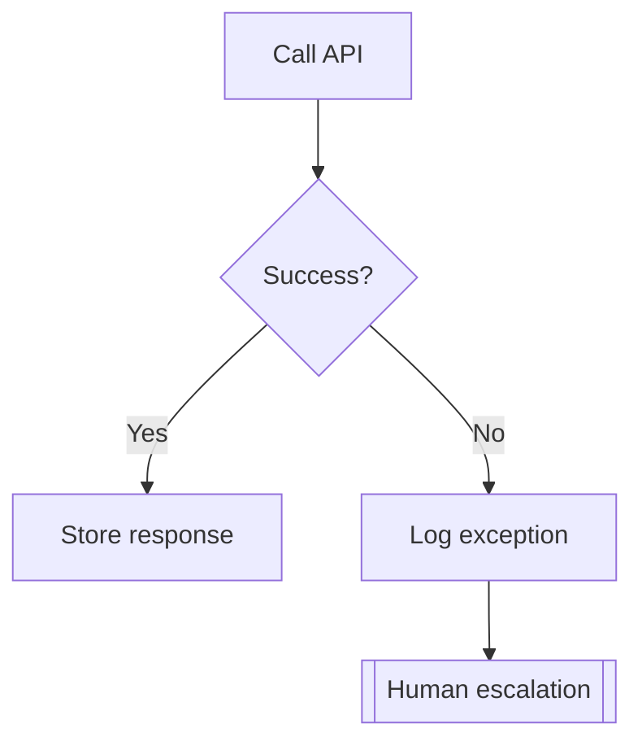
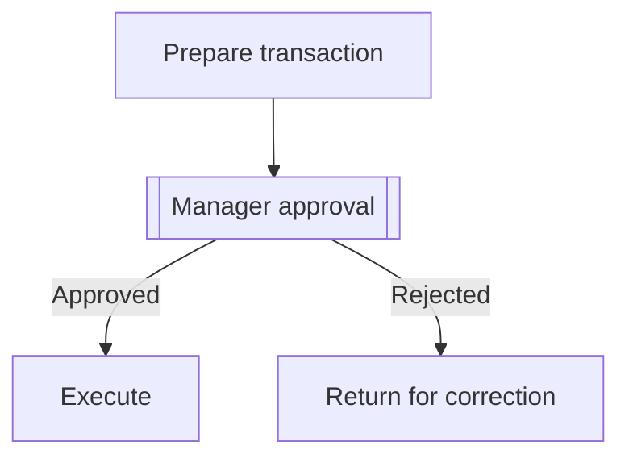
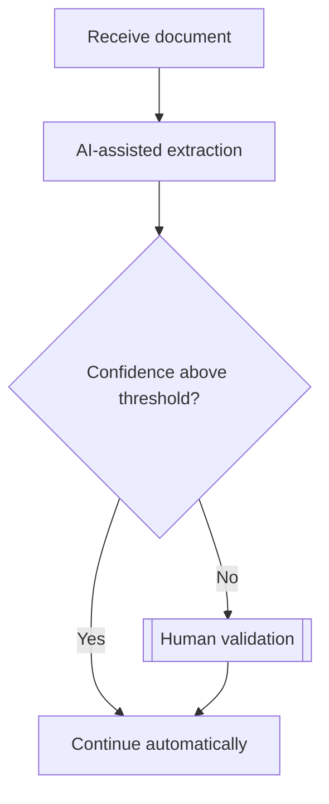
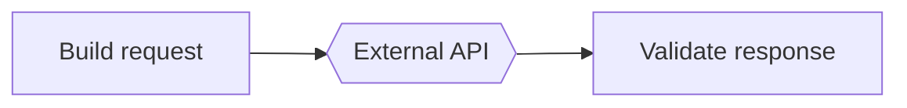
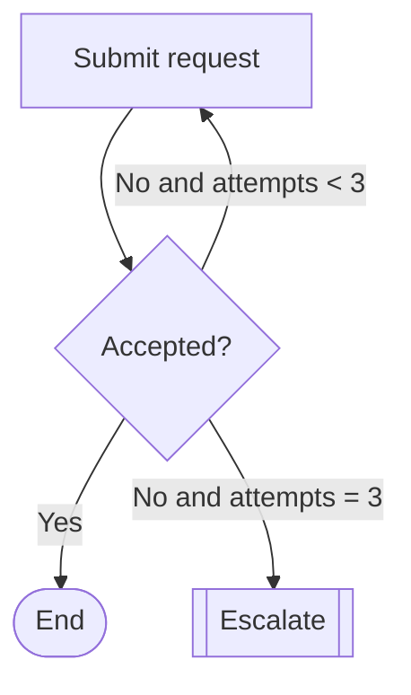

# Process Documentation — 008 Project Discovery & Estimation Studio

## Purpose

Define how TimeEstimator converts structured assessment, process, estimation, and
traceability data into initial process and delivery documentation. Generated
artifacts are drafts for human review, not authoritative operating procedures.

## Source-of-truth rule

The source of truth is the structured domain model:

- `ProjectAssessment` and answers;
- `ProcessDefinition.steps` and `ProcessDefinition.edges`;
- reviewed `GeneratedActivityProposal` records;
- `EstimateScenario` outputs;
- assumptions, risks, systems, actors, and traceability references.

Markdown, Mermaid, HTML, PNG, and PDF are derived projections. Manual text must be
stored separately from generated blocks so regeneration does not destroy it.

## Artifact catalog

### 1. Process Overview

Sections:

- purpose and business outcome;
- scope and exclusions;
- trigger and completion condition;
- process owner, actors, and stakeholders;
- systems and environments;
- inputs and outputs;
- frequency, volume, and duration;
- current pain points;
- automation/AI suitability summary;
- open questions and confidence.

### 2. Current-State Flow

Sections:

- narrative summary;
- structured step table;
- Mermaid flow;
- actors/systems matrix;
- decisions and branch conditions;
- exceptions, retries, and escalations;
- handoffs and wait states;
- evidence gaps.

### 3. Proposed Future-State Flow

Sections:

- design goals;
- retained human responsibilities;
- deterministic automation steps;
- AI-assisted steps;
- approvals and human review;
- controls, audit, and observability;
- fallback and recovery;
- future-state Mermaid flow;
- differences from current state.

A future-state step must reference one or more current-state steps, an assessment
answer, or an explicit design decision.

### 4. Activity Breakdown

Columns:

- activity/proposal ID;
- phase;
- activity name;
- source process step(s);
- system/application;
- core or supervised;
- base effort;
- factors;
- calculated effort;
- overhead treatment;
- confidence;
- rationale;
- assumptions;
- inclusion/applied status.

### 5. Assumptions and Risks

Sections:

- validated assumptions;
- open assumptions;
- invalidated assumptions;
- risks by impact and likelihood descriptor;
- mitigations;
- owners or required decision makers;
- estimate impact;
- open questions.

The MVP does not require a probabilistic risk model.

### 6. Integration Inventory

Columns:

- source system;
- target system;
- direction;
- data/object;
- protocol/channel;
- authentication;
- frequency/volume;
- environment;
- access status;
- error/retry behavior;
- evidence status;
- related steps and activities.

### 7. Initial Delivery Plan

Sections:

- delivery principles;
- phases;
- milestones;
- deliverables;
- entry/exit gates;
- dependencies;
- UAT and acceptance;
- deployment and rollback;
- training/change management;
- stabilization/hypercare;
- unresolved planning assumptions.

Dates are optional until resourcing and calendar constraints are known.

### 8. Estimation Summary

Sections:

- executive statement;
- optimistic, expected, conservative scenarios;
- range and confidence;
- base vs overhead breakdown;
- phase/work-type breakdown;
- core vs supervised;
- major drivers;
- top unknowns;
- assumptions and exclusions;
- recommended discovery actions;
- rule/catalog version and generated date.

## DocumentationArtifact structure

Each artifact is composed of ordered blocks:

```ts
type DocumentationBlock =
  | ParagraphBlock
  | BulletListBlock
  | KeyValueBlock
  | DataTableBlock
  | MetricGroupBlock
  | FlowReferenceBlock
  | CalloutBlock
  | PageBreakHintBlock;
```

Every generated block carries `sourceRefs`. A manual block carries a timestamp and
manual provenance but may optionally link evidence.

## Generation rules

1. Do not create facts for unanswered or unknown fields.
2. Use `Unknown`, `Not confirmed`, or omit the field according to the artifact
   template.
3. Distinguish observation, assumption, recommendation, and decision.
4. Include material contradictions and unresolved high-impact unknowns.
5. Do not imply that a suggested future-state flow is approved.
6. Do not include excluded activity proposals in the estimate breakdown unless
   listed under exclusions.
7. Use reviewed data preferentially; label unreviewed sources.
8. Preserve stable section IDs between regenerations.

## Regeneration policy

### Generated sections

May be regenerated when source data changes. The artifact stores an input snapshot
hash and becomes `stale` when relevant source versions differ.

### Manual sections

Default behavior: preserve. The user must explicitly choose to replace or unlock a
manual section.

### Mixed sections

Use stable blocks:

```text
[generated block]
[manual block]
[generated block]
```

Regeneration replaces only generated blocks with matching stable section keys.

### Diff review

Before replacing reviewed generated content, show:

- added blocks;
- removed blocks;
- changed blocks;
- changed source references;
- new unknowns or contradictions.

## Process flow model

### Structured source

```text
ProcessDefinition
  actors[]
  systems[]
  steps[]
  edges[]
```

`orderHint` supports readable lists but does not define all graph semantics.

### Edge semantics

- `sequence`: normal path;
- `conditional`: decision branch;
- `exception`: failure or business exception path;
- `retry`: declared loop/retry;
- `escalation`: route to human or higher control.

### Validation before rendering

- one or more start nodes;
- one or more end nodes;
- no dangling edge references;
- every decision has at least two meaningful outcomes unless explicitly single-
  condition gate;
- cycles must contain a retry/loop edge and termination condition note;
- disconnected steps are flagged;
- duplicate stable IDs are errors;
- labels are escaped before Mermaid generation.

## Mermaid projection

### MVP syntax

Use `flowchart TD` by default.



### Node shapes

Recommended projection:

- start/end: stadium/rounded terminal;
- task: rectangle;
- decision: diamond;
- approval/human review: subroutine or clearly labeled rectangle;
- integration: hexagon or labeled rectangle;
- exception: warning-styled rectangle;
- AI task: labeled rectangle with `AI-assisted` text.

The structured step type remains authoritative; Mermaid shape is presentational.

### Stable Mermaid IDs

Convert stable process step IDs to safe IDs:

```text
ps-72a9 -> PS_72A9
```

Never derive IDs from mutable step labels alone.

### Escaping

Escape quotes, brackets, pipes, line breaks, and Mermaid control characters. On
projection failure, retain the model and display a textual fallback.

## Conceptual swimlanes

For MVP, actor or system grouping may be represented using subgraphs:



Limitations:

- Mermaid subgraphs are not formal BPMN lanes;
- cross-lane routing may become visually noisy;
- large processes require sectioning/subprocess views.

Formal BPMN export is a future adapter, not MVP source of truth.

## Required flow examples

### Linear process



### Decision



### Exception



### Human approval



### Supervised AI step



### External integration



### Retry loop



The structured retry edge must include its termination condition.

## Current-state to future-state mapping

Each future-state step includes references:

```ts
interface FutureStateMapping {
  futureStepId: string;
  currentStepIds: string[];
  changeType: "retain" | "automate" | "assist" | "remove" | "combine" | "new_control";
  rationale: string;
  decisionRefs: TraceabilityReference[];
}
```

This enables a transformation summary:

- manual steps removed;
- steps automated;
- AI-assisted decisions introduced;
- retained human approvals;
- new controls/fallbacks;
- unresolved design decisions.

## Integration with activity proposals

A flow step may map to zero, one, or multiple activity proposals. A proposal may
map to multiple grouped steps. Documentation shows the relationship rather than
assuming one-to-one mapping.

Applied activities retain the proposal ID and origin step IDs. Legacy activities
without origin are labeled `manual/legacy` until linked.

## Edit and ownership model

- Assessment/process facts: editable by user.
- Generated documentation: draft and replaceable after diff review.
- Manual documentation: preserved by default.
- Reviewed artifact: can become stale but is not silently overwritten.
- Export: generated from selected artifact versions.

## Known limitations for MVP

- No collaborative editing or author identity.
- No binary evidence ingestion.
- No full BPMN semantics or interchange.
- No automatic diagram layout guarantees for very large graphs.
- No server-side document generation.
- No automatic legal/compliance validation.
- Generated prose requires human review.

## Acceptance criteria

- All eight artifacts can be generated from deterministic templates.
- Unknown values are represented honestly.
- Every generated block has traceability references.
- A reviewed manual block survives regeneration.
- Current and future flows derive from structured steps/edges.
- Mermaid examples for linear, decision, exception, approval, AI supervision,
  integration, retry, and end are supported.
- Invalid Mermaid projection does not corrupt structured process data.
- Future-state steps link to current-state evidence or explicit decisions.
- Activity breakdown links process steps, proposals, and applied activities.
